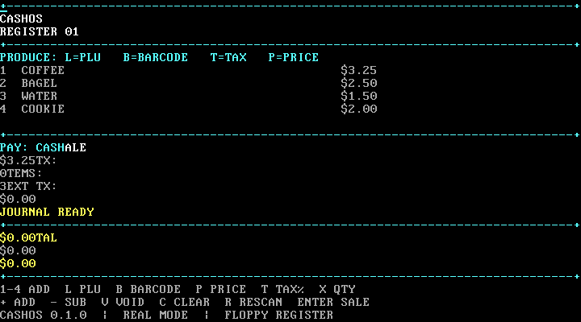

# 🧾 CashOS



[](https://github.com/LuckyMonkey/cashos/actions/workflows/pages.yml)
[](LICENSE)
[](https://github.com/LuckyMonkey/cashos/commits/master)
[](https://github.com/LuckyMonkey/cashos/stargazers)

> **GitHub Pages is serving a floppy.** The browser emulates the PC, the floppy contains CashOS, and CashOS boots directly into the register. 🖥️💾

CashOS is a deliberately tiny bare-metal x86 cash register. It boots from a standard 1.44 MB floppy image, runs as 16-bit NASM real-mode code, writes directly to VGA text memory, reads the keyboard through the BIOS, and stores completed transactions in raw floppy sectors.

There is no Linux or DOS inside the guest. Linux is only the host development environment used to assemble, inspect, test, and run the image.

## 🚀 Try the browser demo

**[▶️ Open CashOS in your browser](https://luckymonkey.github.io/cashos/)**

The demo runs the same `build/register.img` produced by this repository inside [v86](https://github.com/copy/v86). Click the CRT screen to capture the keyboard. The browser shell is only a launchpad around the emulator; it does not recreate the register UI.

## ✨ What is working

- 🥾 BIOS → boot sector → fixed-sector stage two
- 🧮 Integer-cent arithmetic with custom prices, quantities, tax, void, clear, and payment modes
- 🏷️ Catalog items with store SKU, UPC, PLU, department, tax class, and payment flags
- 🍎 Produce PLUs loaded from editable CSV data
- 💾 Persistent 32-byte transaction records in raw floppy sectors
- 🖥️ Direct 80×25 VGA text output
- ⌨️ BIOS keyboard input plus UPC/barcode entry mode
- 🧪 QEMU smoke tests, journal persistence tests, binary inspection, and size checks
- 🌐 Static v86 browser emulator deployed through GitHub Pages

## 🧭 The machine path

```text
power on
   ↓
PC BIOS
   ↓
LBA 0: src/boot.asm
   ↓
LBA 1–64: CashOS stage two
   ↓
16-bit real-mode register
   ├── VGA text memory at 0xB8000
   ├── BIOS keyboard INT 16h
   ├── BIOS floppy reads/writes INT 13h
   └── journal records at LBA 128+
```

## 🎛️ Register controls

| Keys | Action |
| --- | --- |
| `1`–`4` | Add a catalog item |
| `L` + PLU + `Enter` | Add a produce item |
| `B` + 12-digit UPC + `Enter` | Scan/add a barcode item |
| `P` + cents + `Enter` | Add a custom cash-only price |
| `T` + percentage + `Enter` | Set the sale tax rate |
| `X` + quantity + `Enter` | Set quantity for the next item |
| `E` / `K` / `N` | EBT / card / cash payment mode |
| `V` / `C` | Void the last item / clear the sale |
| `R` | Rescan the transaction journal |
| `Enter` | Commit the current sale |

## 🧰 Build and run locally

```sh
./scripts/bootstrap-debian.sh   # print/install Debian or Ubuntu prerequisites
make                            # build build/register.img
make smoke                      # boot headlessly and check CASHOS_READY
make run                        # open the QEMU VGA window
make qemu-screenshot             # refresh this real-QEMU screenshot
make check                      # build, smoke-test, persistence-test, inspect
```

Useful inspection commands:

```sh
make size
make layout
make disasm
make hex
make journal
```

`make debug` starts QEMU paused with a GDB stub on port 1234. See [HACKING.md](HACKING.md) for the real-mode debugging workflow.

## 📦 Editable catalog data

The source-of-truth catalog is [data/catalog.csv](data/catalog.csv). Produce PLUs are in [data/fruit_plu.csv](data/fruit_plu.csv). The build converts those tables into NASM include files under `build/`; the floppy contains the generated assembly data, not a guest filesystem.

Department codes and tax/payment rules live with each item so the register can reject an incompatible payment method, such as EBT for a non-eligible department.

## 🌐 Browser development

```sh
make web
make web-serve
```

Then open `http://localhost:8000/`. Serve over HTTP rather than `file://` so the browser can load WebAssembly and emulator assets. Browser-session floppy writes are not persisted across refreshes yet.

## 🗂️ Repository map

| Path | Purpose |
| --- | --- |
| `src/` | Bootloader and modular real-mode assembly |
| `include/` | Hardware and disk constants |
| `data/` | Human-editable catalog and PLU tables |
| `scripts/` | Image building, QEMU, tests, and data import |
| `tools/` | Host-side journal inspection |
| `web/` | Static v86 wrapper and CRT-style shell |
| `docs/` | Memory map and project screenshots |

## 🗺️ Next on the roadmap

The intentionally small foundation leaves room for an admin floppy that edits catalog data, employee-register update media, richer department policy, journal recovery, and eventually a protected-mode/freestanding-C layer. Those are future milestones—not hidden dependencies in the current image.

## ⚠️ Physical floppy warning

Use `scripts/write-floppy.sh` only with an explicit device path after checking `lsblk`. It requires the exact confirmation `CASHOS-WRITE` and is never part of a normal build.

## 📚 Learn the details

- [Architecture](ARCHITECTURE.md)
- [Hacking guide](HACKING.md)
- [Disk layout](DISK_LAYOUT.md)
- [Memory map](docs/memory-map.md)
- [Browser demo notes](web/README.md)
- [GitHub project](https://github.com/LuckyMonkey/cashos)
